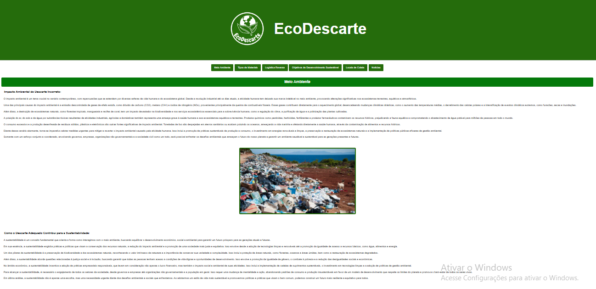

<h1 align="center"> Projeto ODS </h1>

Projeto A3 Faculdade

  <a href="#-tecnologias">Tecnologias</a>&nbsp;&nbsp;&nbsp;|&nbsp;&nbsp;&nbsp;
  <a href="#-projeto">Projeto</a>&nbsp;&nbsp;&nbsp;|&nbsp;&nbsp;&nbsp;

 

  

## 🚀 Tecnologias

Esse projeto foi desenvolvido com as seguintes tecnologias:

- HTML e CSS
- Git e Github

## 💻 Projeto

Neste projeto, desenvolvi um site voltado para conscientização sobre a coleta de lixo e a localização de pontos de descarte na Baixada Santista. O objetivo é facilitar o acesso a informações sobre como descartar corretamente resíduos como lixo eletrônico, recicláveis, orgânicos e outros tipos específicos.
Com uma interface intuitiva e design responsivo, o projeto visa atingir um público amplo e engajá-lo na preservação ambiental, oferecendo uma solução prática para quem deseja fazer a diferença.

---

Feito por Guilherme Lins Oliveira.
